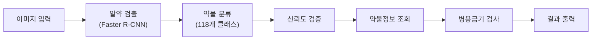
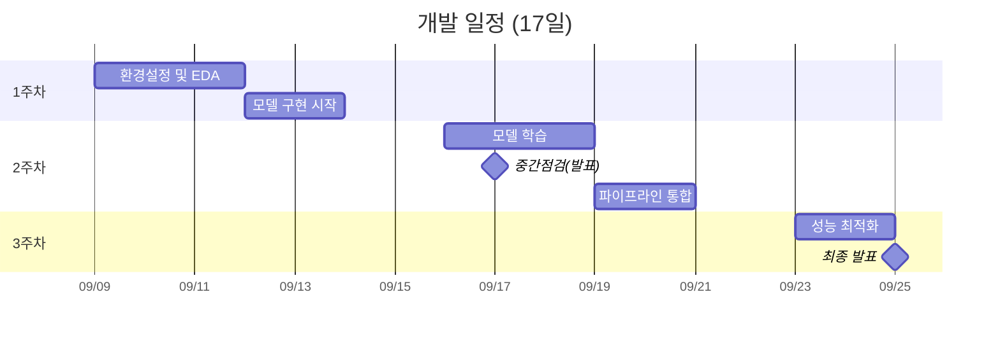

# 경구약제 이미지 인식 AI 프로젝트
**코드잇 AI 4기 4팀 - 헬스케어 스타트업 "헬스잇(Health Eat)" AI 엔지니어링 팀**

[](https://www.python.org/downloads/)
[](https://pytorch.org/)
[](https://github.com/ultralytics/ultralytics)

## 📋 목차
- [프로젝트 개요](#프로젝트-개요)<br/>
- [핵심 기능](#핵심-기능)<br/>
- [팀 구성](#팀-구성)<br/>
- [기술 스택](#기술-스택)<br/>
- [시작하기](#시작하기)<br/>
- [개발 일정](#개발-일정)<br/>
- [성과 및 결과](#성과-및-결과)<br/>
- [협업 일지](#협업-일지)<br/>
- [문서](#문서)<br/>

## 🎯 프로젝트 개요

### 미션
모바일 애플리케이션으로 촬영한 약물 이미지에서 **최대 4개의 알약을 동시에 검출하고 분류**하여, 사용자에게 약물 정보 및 상호작용 경고를 제공하는 AI 시스템을 개발합니다.

### 프로젝트 제약사항
- **개발 기간**: 2025.09.09 ~ 2025.09.25 (17일)
- **팀 구성**: 5명 (PM 1명 + 전문가 4명)
- **평가**: Kaggle Private Competition (하루 10회 제출 제한)
- **데이터 제약**: 특정 조합 데이터 사용 금지 (TL_2_조합.zip, TS_2_조합.zip)

## ✨ 핵심 기능



- **다중 객체 탐지**: 한 이미지에서 최대 4개 알약 동시 인식
- **정확한 분류**: 118개 알약 클래스 분류
- **위치 정보**: 바운딩 박스를 통한 정확한 위치 표시
- **신뢰도 검증**: 다단계 검증을 통한 결과 신뢰성 확보
- **안전성 정보**: 약물 상호작용 및 병용금기 경고 제공

## 👥 팀 구성

| 역할 | 담당자 | 핵심 업무 |
|------|--------|-----------|
| **Project Manager** | 이건희 | 프로젝트 총괄 관리, 일정 조율 |
| **Data Engineer** | 서동일 | EDA, 데이터 전처리, 증강 기법 |
| **Model Architect** | 김명환 | 모델 설계 및 구현 |
| **Experimentation Lead** | 김민혁 | 실험 설계, Kaggle 제출, 성능 튜닝 |
| **Quality Assurance** | 이현재 | 코드 품질, 문서화, 결과 검증 |

## 🛠 기술 스택

**프레임워크 및 라이브러리**
- **딥러닝**: PyTorch, Torchvision
- **객체 탐지**: Faster R-CNN (ResNet101 백본)
- **분류 모델**: EfficientNet-B3 (옵션)
- **컴퓨터 비전**: OpenCV, Pillow, Albumentations
- **데이터 처리**: NumPy, Pandas, Scikit-learn
- **GUI**: PyQt5

**개발 도구**
- **버전 관리**: Git, GitHub
- **실험 관리**: Kaggle, TensorBoard
- **문서화**: Markdown, Mermaid

> **상세 아키텍처**: [아키텍처 설계 문서](./아키텍처설계_v2.md) 참조

## 🚀 시작하기

### 시스템 요구사항
```yaml
Hardware:
  GPU: "NVIDIA GTX 1080Ti 이상 (VRAM 8GB+)"
  RAM: "16GB 이상"
  Storage: "50GB 이상 여유 공간"

Software:
  Python: "3.8+"
  CUDA: "11.7+"
  PyTorch: "2.0+"
```

### 설치 방법

```bash
# 1. 저장소 클론
git clone https://github.com/codeit-ai4-team4/pill-detection-project.git
cd pill-detection-project

# 2. 의존성 설치
pip install -r requirements.txt

# 3. GUI 프로그램 실행
python main.py
```

### 프로젝트 구조

```
project/
├── main.py                          # GUI 메인 프로그램
├── PillAnalysisEngine.py            # AI 엔진
├── TeamInfoDialog.py                # 팀 정보 다이얼로그
├── requirements.txt                 # 의존성
└── python_modules/
    ├── modeling/                    # 모델 파일
    │   ├── fasterrcnn_resnet101/
    │   ├── yolo8m/
    │   └── efficientnet_b3/
    ├── data/                        # 데이터베이스
    │   ├── df_drug_118.pkl
    │   └── df_병용금기약물_20240813.pkl
    ├── sampledata/                  # 샘플 이미지
    └── utils/                       # 유틸리티
```

## 📅 개발 일정

### 전체 타임라인



### 주요 마일스톤

| 날짜 | 마일스톤 | 담당 |
|------|----------|------|
| **9/9** | 프로젝트 킥오프 | 전원 |
| **9/17** | **중간 발표** | 전원 |
| **9/20** | 첫 Kaggle 제출 | 김민혁 |
| **9/25** | **최종 발표** | 전원 |

## 📊 성과 및 결과

### 성능 목표

| 지표 | 목표값 | 실제값 |
|------|--------|--------|
| mAP＠0.5 | > 0.75 | TBD |
| Precision | > 0.80 | TBD |
| Recall | > 0.75 | TBD |
| F1-Score | > 0.77 | TBD |
| 추론 시간 | < 2초 | TBD |

### Kaggle 순위
- **목표**: 상위 30%
- **실제**: TBD

## 📝 협업 일지

팀원별 개발 과정 및 학습 내용을 기록한 협업 일지입니다.

- [이건희 협업일지 (Project Manager)](https://c0z0c.github.io/codeit_ai_health_eat/협업일지/이건희/)
- [서동일 협업일지 (Data Engineer)](https://c0z0c.github.io/codeit_ai_health_eat/협업일지/서동일/)
- [김명환 협업일지 (Model Architect)](https://c0z0c.github.io/codeit_ai_health_eat/협업일지/김명환/)
- [김민혁 협업일지 (Experimentation Lead)](https://c0z0c.github.io/codeit_ai_health_eat/협업일지/김민혁/)
- [이현재 협업일지 (Quality Assurance)](https://c0z0c.github.io/codeit_ai_health_eat/협업일지/이현재/)
- [팀 회의록](https://c0z0c.github.io/codeit_ai_health_eat/회의록/)

## 📚 문서

### 핵심 문서
- **[아키텍처 설계 문서](./아키텍처설계_v2.md)**: 상세한 시스템 아키텍처 및 기술 스펙
- **[API 문서](./PillAnalysisEngine.py)**: PillAnalysisEngine 클래스 사용법

### 주요 참고 자료

**객체 탐지 및 분류**
- Faster R-CNN: "Faster R-CNN: Towards Real-Time Object Detection" (Ren et al., 2015)
- EfficientNet: "EfficientNet: Rethinking Model Scaling" (Tan & Le, 2019)
- YOLO v8: Ultralytics Documentation

**의료 AI**
- "Deep Learning in Medical Image Analysis" (Litjens et al., 2017)
- AI Hub 경구약제 데이터셋

## 🔍 사용 예시

### GUI 애플리케이션

```bash
python main.py
```

### Python API

```python
from PillAnalysisEngine import PillAnalysisEngine

# 엔진 초기화
engine = PillAnalysisEngine(
    model_1_stage_path="modeling/fasterrcnn_resnet101/best.pt"
)

# 이미지 분석
result = engine.analyze_image("sample.png")

# 결과 출력
print(f"탐지된 알약: {len(result['bboxs'])}개")
for pill in result['bboxs']:
    print(f"- {pill['class_name']}: {pill['class_score']:.2f}")
```

### 출력 예시

```json
{
  "img_path": "/path/to/image.png",
  "bboxs": [
    {
      "class_id": 3543,
      "class_name": "타이레놀",
      "xyxy": [10, 20, 50, 60],
      "detect_score": 0.95,
      "class_score": 0.92,
      "drug_info": {
        "drug_N": "아세트아미노펜",
        "dl_name": "타이레놀정 500mg"
      },
      "ddi_drug": {
        "금기사유": "횡문근융해와 같은 중증의 근육이상 보고"
      }
    }
  ]
}
```

## 🎓 학습 성과

이 프로젝트를 통해 학습한 핵심 기술:

- **객체 탐지**: Faster R-CNN, YOLO v8 실무 적용
- **이미지 분류**: EfficientNet 아키텍처 이해
- **데이터 엔지니어링**: 전처리, 증강, 파이프라인 구축
- **MLOps**: 모델 버전 관리, 실험 추적, 배포
- **협업**: Git Flow, 코드 리뷰, 문서화

## 📄 라이선스

이 프로젝트는 MIT 라이선스 하에 배포됩니다.

```
MIT License

Copyright (c) 2025 코드잇 AI 4기 4팀

Permission is hereby granted, free of charge, to any person obtaining a copy
of this software and associated documentation files (the "Software"), to deal
in the Software without restriction...
```

## 🙏 감사의 말

- **코드잇 AI 부트캠프**: 프로젝트 기회 제공
- **AI Hub**: 경구약제 데이터셋 제공
- **식품의약품안전처**: 의약품통합정보시스템 API

---