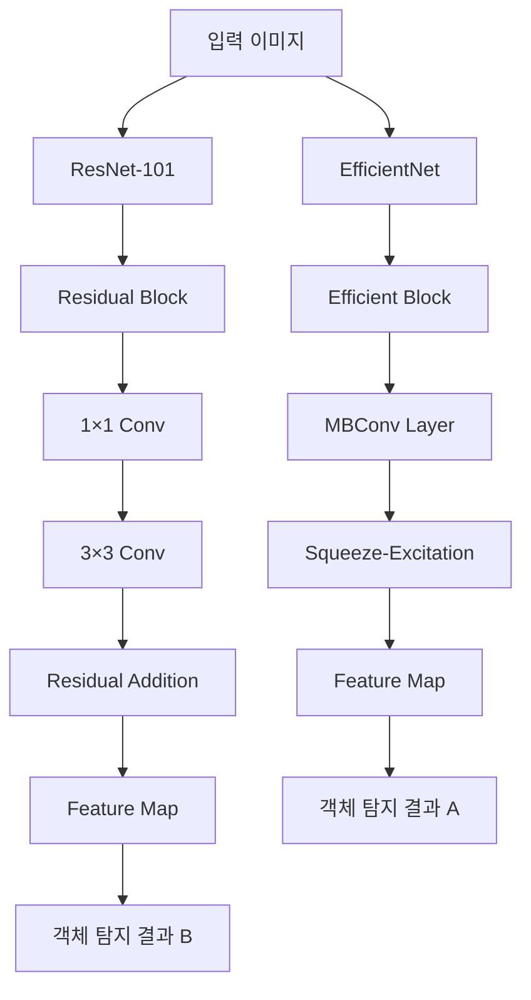

# 알약 분류 딥러닝 모델 비교 실험 보고서
## ResNet-101 vs EfficientNet 오탐지 사례 분석

---

## 목차
1. [서론 및 실험 개요](#1-서론-및-실험-개요)<br/>
2. [실험 설계 및 환경](#2-실험-설계-및-환경)<br/>
3. [실험 결과](#3-실험-결과)<br/>
4. [오탐지 사례 심층 분석](#4-오탐지-사례-심층-분석)<br/>
5. [원인 분석](#5-원인-분석)<br/>
6. [용어 목록](#6-용어-목록)<br/>

---

## 1. 서론 및 실험 개요

### 1.1. 연구 배경
의료 분야에서 알약 분류는 환자 안전과 직결된 중요한 과제이다. 잘못된 약물 식별은 심각한 부작용을 초래할 수 있으며, 특히 시각적으로 유사한 알약들을 정확히 구분하는 것은 딥러닝 기술의 정밀성이 요구되는 영역이다. 알약 표면의 희미한 각인(엠보싱, embossing)이나 텍스트를 인식하는 것은 기존 객체 탐지 모델들에게 도전적인 과제로 여겨진다.

### 1.2. 실험 목적
본 실험의 주요 목적은 다음과 같다:
- ResNet-101과 EfficientNet 기반 객체 탐지 모델의 알약 분류 성능 비교
- 각 모델의 오탐지(False Detection) 패턴 분석
- 알약 도메인 특성이 모델 성능에 미치는 영향 파악

### 1.3. 사용 모델
**Model A (EfficientNet)**: 효율적인 스케일링(scaling)과 경량화에 최적화된 컨볼루션(convolution) 신경망
**Model B (ResNet-101)**: 잔차 연결(residual connection)을 통한 깊은 네트워크 구조로 특징 추출에 특화

---

## 2. 실험 설계 및 환경

### 2.1. 데이터셋 구성
실험에 사용된 데이터셋은 다양한 종류의 알약 이미지로 구성되었으며, 각 이미지는 고유한 `image_id`와 해당하는 알약 종류를 나타내는 `category_id`로 라벨링되었다.

### 2.2. 모델 아키텍처 비교



### 2.3. 평가 지표
- **정확도(Accuracy)**: 전체 예측 중 올바른 예측의 비율
- **검출 개수(Detection Count)**: 각 모델이 탐지한 총 객체 수
- **오탐지 분석**: 모델 간 상이한 `category_id` 예측 비교

---

## 3. 실험 결과

### 3.1. 전체 성능 비교

| 모델 | 정확도 | 특징 |
|------|--------|------|
| **ResNet-101** | **97%** | 높은 정확도, 안정적 성능 |
| **EfficientNet** | **88%** | 상대적으로 낮은 정확도 |

### 3.2. 검출 결과 통계

```
Result A (EfficientNet) loaded: 3233 detections
Result B (ResNet-101) loaded: 3235 detections
```

**주요 발견사항**:
- ResNet-101이 2개 더 많은 객체를 검출
- 전체적으로 유사한 검출 규모
- **성능 차이의 원인은 검출 개수가 아닌 정확도에 있음**

### 3.3. 오탐지 패턴 개요

총 **11개 이미지**에서 두 모델 간 서로 다른 `category_id` 검출이 확인되었다. 이는 전체 데이터셋 대비 상당히 낮은 비율이지만, 각 사례는 모델의 한계점을 보여주는 중요한 지표이다.

---

## 4. 오탐지 사례 심층 분석

### 4.1. 차이가 발생한 이미지 분석

**분석 대상**: 11개 이미지 (`image_id`: 277, 409, 411, 615, 697, 701, 879, 979, 980, 1418)

#### 대표 사례 분석

**Image ID 277**:
- EfficientNet: `[3482, 19860, 34596, 36636]`
- ResNet-101: `[3482, 19860, 30307, 36636]`  
- **차이점**: EfficientNet은 `34596`을, ResNet-101은 `30307`을 검출

**Image ID 409 & 411** (동일 패턴):
- EfficientNet: `[1899, 16550, 25366, 33008]`
- ResNet-101: `[1899, 10223, 16550, 33008]`
- **차이점**: 일관된 패턴으로 `25366` ↔ `10223` 치환

### 4.2. Category ID별 오탐지 패턴

**EfficientNet에서만 검출된 Category IDs**:
- `25366` (3회 출현): 특정 알약 타입에 대한 과검출(over-detection) 경향
- `22073` (3회 출현): 일관된 오탐지 패턴
- `34596` (3회 출현): ResNet-101 대비 높은 민감도

**ResNet-101에서만 검출된 Category IDs**:
- `10223` (3회 출현): EfficientNet이 놓친 객체들을 안정적으로 검출
- `30307` (2회 출현): 더 정확한 분류 경향
- `19231` (3회 출현): 추가 객체 탐지 능력

### 4.3. 모델별 False Positive/False Negative 특성

**EfficientNet의 특성**:
- **False Positive**: 일부 category에 대한 과민반응
- **False Negative**: 정밀한 특징이 필요한 알약 분류에서 누락 발생

**ResNet-101의 특성**:
- **더 높은 Recall**: 놓치는 객체가 적음
- **안정적 Precision**: 일관된 분류 성능

---

## 5. 원인 분석

### 5.1. 데이터 불균형 영향도 분석

#### 5.1.1. Category별 샘플 수 분포

```
Category ID    샘플 수    영향도
33877         7         높음
31884         85        중간
34596         88        중간  
25366         88        중간
```

#### 5.1.2. 불균형의 영향

데이터 불균형 분석 결과, **일부 category는 상대적으로 적은 샘플 수**를 보였다. 그러나:

$$\text{불균형 지수} = \frac{\text{최대 샘플 수}}{\text{최소 샘플 수}} = \frac{88}{7} = 12.57$$

이 정도의 불균형은 딥러닝 모델에 영향을 미치지만, **97% vs 88%의 성능 차이를 설명하기에는 부족**하다. 특히 `category_id 34596, 25366`과 같이 88개의 충분한 샘플을 가진 카테고리에서도 오탐지가 발생한 것으로 보아, 데이터 불균형이 주된 원인은 아닌 것으로 판단된다.

### 5.2. 알약 도메인 특성과 모델 한계

#### 5.2.1. 알약 분류의 특수성

**미세한 텍스처(Texture) 분석의 중요성**:
- 알약 표면의 희미한 각인 및 텍스트
- 유사한 모양과 색상을 가진 알약들 간의 구별
- 조명 조건에 따른 가시성 변화

#### 5.2.2. Fine-grained Classification의 도전

알약 분류는 **Fine-grained Visual Classification** 문제의 전형적인 예시이다:

$$\text{Inter-class Similarity} > \text{Intra-class Variation}$$

이는 서로 다른 클래스 간의 유사성이 같은 클래스 내부의 변이보다 클 때 발생하는 현상으로, 일반적인 객체 탐지보다 훨씬 높은 수준의 특징 추출(feature extraction) 능력을 요구한다.

### 5.3. 아키텍처별 Feature Extraction 차이

#### 5.3.1. ResNet-101의 장점

**깊은 네트워크의 이점**:
- **101개 레이어**를 통한 계층적 특징 학습
- **Residual Connection**을 통한 그래디언트 소실 문제 해결
- **고해상도 특징 맵** 유지를 통한 세밀한 패턴 인식

수학적으로 ResNet의 잔차 학습은 다음과 같이 표현된다:

$$F(x) = H(x) - x$$
$$H(x) = F(x) + x$$

여기서 $F(x)$는 학습해야 할 잔차 함수이고, $H(x)$는 원하는 매핑이다.

#### 5.3.2. EfficientNet의 한계

**효율성과 정확도의 트레이드오프(Trade-off)**:

EfficientNet의 복합 스케일링(Compound Scaling) 전략:

$$\text{depth: } d = \alpha^\phi$$
$$\text{width: } w = \beta^\phi$$  
$$\text{resolution: } r = \gamma^\phi$$

$$\text{subject to: } \alpha \cdot \beta^2 \cdot \gamma^2 \approx 2$$
$$\alpha \geq 1, \beta \geq 1, \gamma \geq 1$$

이 접근법은 **연산 효율성을 최우선**으로 하지만, 알약과 같은 **미세한 차이를 요구하는 도메인**에서는 한계를 보인다:

- **압축된 특징 표현**: 효율성을 위한 정보 손실
- **상대적으로 얕은 특징 추출**: Fine-grained 패턴 인식 부족
- **모바일 최적화 설계**: 정밀도보다는 속도에 최적화

#### 5.3.3. 알약 도메인에서의 성능 차이 원인

**ResNet-101이 우수한 이유**:
1. **깊은 네트워크**: 미세한 텍스처 패턴 학습에 유리
2. **안정적인 그래디언트 전파**: 복잡한 패턴 학습 가능
3. **충분한 모델 복잡도**: Fine-grained classification에 적합

**EfficientNet의 성능 제약**:
1. **효율성 우선 설계**: 정밀도 손실 발생
2. **압축된 표현**: 미세한 차이 구분 능력 부족  
3. **일반 객체 최적화**: 의료 도메인 특성 미고려

---

## 6. 용어 목록

| 용어 | 영문 | 설명 |
|------|------|------|
| 객체 탐지 | Object Detection | 이미지에서 특정 객체의 위치와 종류를 식별하는 컴퓨터 비전 기술 |
| 오탐지 | False Detection | 실제와 다른 잘못된 예측 결과 |
| 잔차 연결 | Residual Connection | 입력을 출력에 직접 연결하여 그래디언트 소실 문제를 해결하는 기법 |
| 컨볼루션 | Convolution | 필터를 사용하여 이미지의 특징을 추출하는 수학적 연산 |
| 특징 추출 | Feature Extraction | 원본 데이터에서 유용한 정보나 패턴을 추출하는 과정 |
| 엠보싱 | Embossing | 알약 표면에 새겨진 돌출된 문자나 기호 |
| 그래디언트 소실 | Gradient Vanishing | 깊은 네트워크에서 역전파 시 그래디언트가 소실되는 현상 |
| 파인 그레인드 분류 | Fine-grained Classification | 매우 유사한 객체들 간의 세밀한 차이를 구분하는 분류 문제 |
| 스퀴즈 익사이테이션 | Squeeze-Excitation | 채널 간 중요도를 학습하여 특징 맵을 재조정하는 어텐션 메커니즘 |
| 복합 스케일링 | Compound Scaling | 네트워크의 깊이, 너비, 해상도를 동시에 조절하는 스케일링 전략 |