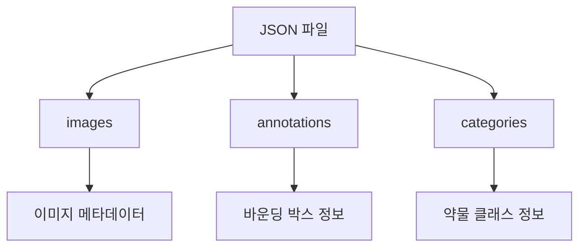
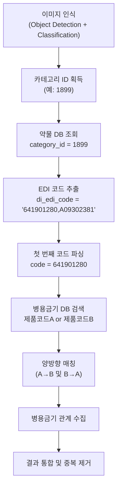
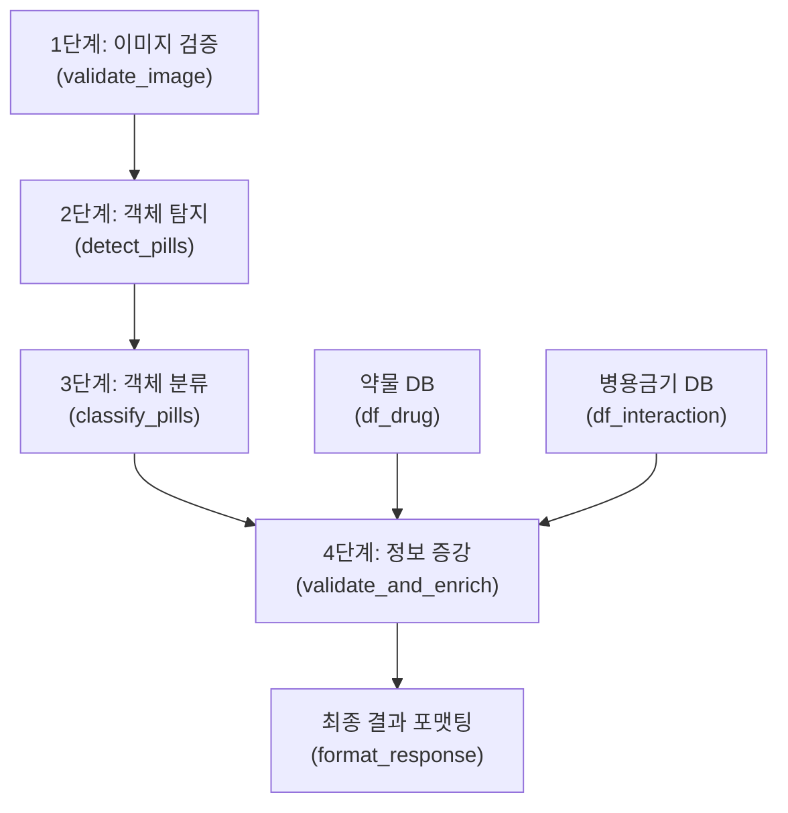
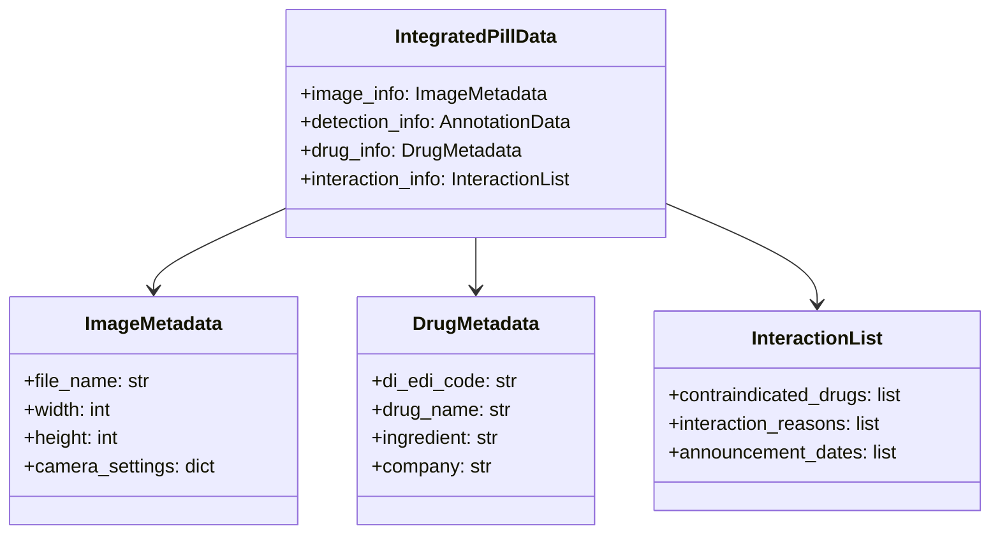

# 경구약제 Annotations 데이터와 병용금기약물 정보 통합 분석 보고서

## 목차
1. [서론](#1-서론) <br/>
   - 1.1. [프로젝트 배경](#11-프로젝트-배경)<br/>
   - 1.2. [프로젝트 목표](#12-프로젝트-목표)<br/>
   - 1.3. [헬스케어 AI의 의의](#13-헬스케어-ai의-의의)<br/>
2. [데이터 분석](#2-데이터-분석)<br/>
   - 2.1. [경구약제 이미지 데이터셋 분석](#21-경구약제-이미지-데이터셋-분석)<br/>
   - 2.2. [병용금기약물 데이터 분석](#22-병용금기약물-데이터-분석)<br/>
3. [데이터 통합 전략](#3-데이터-통합-전략)<br/>
   - 3.1. [EDI 코드 매칭 방법론](#31-edi-코드-매칭-방법론)<br/>
   - 3.2. [정보 증강 파이프라인](#32-정보-증강-파이프라인)<br/>
   - 3.3. [통합 데이터 구조](#33-통합-데이터-구조)<br/>
4. [예상 효과 및 비즈니스 가치](#4-예상-효과-및-비즈니스-가치)<br/>
   - 4.1. [기술적 효과](#41-기술적-효과)<br/>
   - 4.2. [비즈니스 가치](#42-비즈니스-가치)<br/>
5. [결론 및 향후 과제](#5-결론-및-향후-과제)<br/>
   - 5.1. [결론](#51-결론)<br/>
   - 5.2. [향후 과제](#52-향후-과제)<br/>
6. [용어 목록](#6-용어-목록)<br/>

---

## 1. 서론

### 1.1. 프로젝트 배경

헬스잇(Health Eat)의 AI 엔지니어링 팀은 모바일 애플리케이션을 통해 사용자가 복용 중인 약물을 촬영하면, 이미지 인식 기술을 활용하여 해당 약물의 정보를 자동으로 제공하는 서비스를 개발하고 있다. 이를 위해 최대 4개의 알약을 동시에 검출하고 분류할 수 있는 객체 탐지(Object Detection) 모델 구축이 필수적이다.

초기에는 경구약제 이미지 데이터셋만 제공받았으나, 서비스의 실질적인 헬스케어 가치 창출을 위해 한국의약품안전관리원의 병용금기약물 정보를 추가로 확보하였다. 본 보고서는 이미지 데이터와 약물 안전 정보를 통합하여 단순한 약물 식별을 넘어 사용자 안전까지 고려한 지능형 헬스케어 시스템 구축 방안을 제시한다.

### 1.2. 프로젝트 목표

본 프로젝트의 핵심 목표는 다음과 같다:

- **이미지 기반 약물 식별**: 사진 속 최대 4개 알약의 이름(클래스)과 위치(바운딩 박스) 검출
- **약물 안전 정보 제공**: EDI 코드 기반 매칭을 통한 병용금기 정보 연계
- **데이터 통합 파이프라인 구축**: 이미지 데이터와 약물 안전 데이터베이스의 효율적 통합
- **지속적 성능 개선**: 리더보드를 통한 모델 성능 트래킹 및 개선

### 1.3. 헬스케어 AI의 의의

약물 오남용은 전 세계적으로 심각한 보건 문제로, 특히 다제병용(polypharmacy)이 흔한 고령 인구에서 약물 상호작용으로 인한 부작용 위험이 높다. 이미지 인식 기술과 약물 안전 데이터베이스를 결합한 AI 시스템은 다음과 같은 의의를 지닌다:

- **접근성 향상**: 복잡한 약물 정보를 간단한 촬영만으로 확인
- **예방적 헬스케어**: 병용금기 경고를 통한 사전 위험 방지
- **디지털 헬스 리터러시(Health Literacy) 증진**: 약물에 대한 정확한 정보 제공으로 건강 자가관리 능력 향상
- **의료 접근성 개선**: 언제 어디서나 약물 정보 확인 가능

---

## 2. 데이터 분석

### 2.1. 경구약제 이미지 데이터셋 분석

#### 2.1.1. 데이터셋 구조

경구약제 이미지 데이터는 COCO(Common Objects in Context) 포맷을 따르는 JSON 형식으로 제공되며, 다음 세 가지 주요 섹션으로 구성된다:



#### 2.1.2. 이미지 메타데이터(Metadata)

각 이미지는 다음과 같은 풍부한 메타데이터를 포함한다:

**물리적 특성**:
- 약물 형태: 정제, 저작정 등
- 크기 정보: 두께(thick), 장축 길이(leng_long), 단축 길이(leng_short)
- 색상 정보: 주 색상(color_class1), 보조 색상(color_class2)
- 각인 정보: 앞면/뒷면 표기(print_front/print_back)

**약물 정보**:
- EDI 코드: `di_edi_code` (예: "641901280,A09302381")
- 성분명: 한글/영문 병기
- 제조사 정보
- 허가 정보 및 분류

**촬영 조건**:
- 배경색, 조명색
- 카메라 각도(camera_la, camera_lo)
- 이미지 크기(size)

예시 데이터에서 **보령부스파정 5mg**는 다음과 같은 특징을 보인다:
- 형태: 양면 볼록한 장방형 백색 정제
- 크기: 8mm × 4.5mm × 2.5mm
- 각인: 앞면 "BSP", 뒷면 "5"
- 성분: 부스피론염산염(Buspirone Hydrochloride)
- EDI 코드: 641901280, A09302381

#### 2.1.3. 어노테이션(Annotation) 구조

객체 탐지를 위한 어노테이션은 다음 정보를 포함한다:

- **bbox**: $[x, y, width, height]$ 형식의 바운딩 박스 좌표
- **area**: 객체 영역 면적(픽셀 단위)
- **category_id**: 약물 클래스 ID
- **iscrowd**: 군집 객체 여부 (0: 개별 객체)

바운딩 박스는 이미지 내 약물의 정확한 위치를 나타내며, 이는 모델 학습 시 그라운드 트루스(ground truth)로 활용된다.

### 2.2. 병용금기약물 데이터 분석

#### 2.2.1. 데이터셋 개요

한국의약품안전관리원에서 제공하는 병용금기약물 데이터는 다음과 같은 규모와 특성을 지닌다:

**데이터 규모**:
- 파일 크기: 204MB
- 총 레코드 수: 542,996건
- 형식: CSV (15개 컬럼)

**주요 통계량**:

| 항목 | 제품코드A | 제품코드B | 공고번호 |
|------|-----------|-----------|----------|
| 평균 | 607,167,331 | 602,228,295 | 20,145,408 |
| 표준편차 | 155,780,605 | 162,994,389 | 64,507 |
| 최솟값 | 51,600,330 | 51,600,171 | 2,021,113 |
| 최댓값 | 699,917,050 | 698,504,790 | 20,240,030 |

#### 2.2.2. 데이터 구조

병용금기약물 정보는 두 약물 간의 상호작용 정보를 담고 있다:

**약물 A 정보**:
- 성분명A, 성분코드A
- 제품코드A, 제품명A
- 업체명A, 급여구분A

**약물 B 정보**:
- 성분명B, 성분코드B
- 제품코드B, 제품명B
- 업체명B, 급여구분B

**병용금기 정보**:
- 공고번호, 공고일자
- 금기사유 (상세 설명)

#### 2.2.3. 금기사유 분석

제공된 샘플 데이터에서 **bicalutamide**(비칼루타마이드)와 **domperidone**(돔페리돈) 계열 약물 간 병용금기 사례를 확인할 수 있다:

**금기 이유**: "QTc 연장 효과 증대로 심각한 위험(Torsade de Pointes, 심각한 심실성 부정맥 포함) 가능성"

이는 두 약물 모두 심장의 QT 간격(interval)을 연장시킬 수 있어, 병용 시 치명적인 부정맥 위험이 급격히 증가함을 의미한다. 이러한 정보는 약물 안전 관리에 있어 필수적이다.

#### 2.2.4. 제품코드 분포 특성

제품코드는 9자리 정수형 데이터로, 약 51,600,000부터 699,917,000까지 광범위하게 분포한다. 중앙값(median)은 약 647,000,000으로, 최근 등록된 약물일수록 높은 코드 값을 가지는 경향이 있다.

---

## 3. 데이터 통합 전략

### 3.1. EDI 코드 매칭 방법론

#### 3.1.1. EDI 코드 이해

EDI(Electronic Data Interchange) 코드는 의약품 유통 및 보험청구에 사용되는 전자문서교환 표준 코드이다. 경구약제 이미지 데이터의 `di_edi_code` 필드는 다음과 같은 특성을 지닌다:

**형식**: 콤마(,)로 구분된 복수 코드
- 예시: "641901280,A09302381"
- 각 코드는 서로 다른 보험 청구 시스템에서 사용

**매칭 전략**:
1. 이미지 인식을 통해 카테고리 ID 획득 (예: 1899)
2. 카테고리 ID로 약물 데이터베이스 조회
3. EDI 코드 문자열을 콤마 기준으로 분리하여 첫 번째 코드 추출
4. 추출된 코드를 정수형으로 변환 (예: "641901280" → 641901280)
5. 변환된 코드로 병용금기 데이터의 제품코드A, 제품코드B와 비교
6. 일치하는 코드 발견 시 해당 약물로 매핑

#### 3.1.2. 매칭 프로세스

구현된 시스템의 실제 데이터 흐름은 다음과 같다:



**핵심 매칭 로직**:

1. **카테고리 ID 기반 조회**: 이미지 분류 결과로 얻은 카테고리 ID로 약물 데이터베이스 필터링
2. **EDI 코드 변환**: 문자열 형태의 EDI 코드에서 첫 번째 값을 정수로 변환
3. **양방향 검색**: 각 약물 코드에 대해 제품코드A와 제품코드B 양쪽에서 검색
4. **페어(Pair) 매칭**: 인식된 여러 약물 간 조합으로 병용금기 관계 탐색

**예시 시나리오**:
- 이미지에서 약물 A(code: 643305110), 약물 B(code: 653700160) 인식
- code_A = 643305110일 때, 제품코드A = 643305110 조회
- code_B = 653700160일 때, 제품코드B = 653700160 조회
- 두 조건이 모두 만족하는 행 발견 시 병용금기 관계 확정

#### 3.1.3. 매칭 검증 및 결과 구조

실제 구현된 시스템의 검증 절차와 결과 데이터 구조는 다음과 같다:

**검증 단계**:

1. **카테고리-코드 매핑 테이블 생성**:
   - 카테고리 ID와 정수 변환된 EDI 코드를 연결하는 딕셔너리 구성
   - 예: `{643305110: 1899, 653700160: 2345, ...}`

2. **교차 매칭(Cross-matching)**:
   - 인식된 모든 약물 코드 쌍에 대해 이중 루프 실행
   - `code_a`가 제품코드A이고 `code_b`가 제품코드B인 경우
   - `code_b`가 제품코드A이고 `code_a`가 제품코드B인 경우도 탐색

3. **결과 분류 및 집계**:
   - **직접 병용금기(ddi)**: 인식된 약물 간 직접적인 금기 관계
   - **연관 병용금기(ddi_drug)**: 인식된 약물과 관련된 모든 금기 약물
   - **약물 정보(drug)**: 인식된 각 약물의 상세 정보

**반환 데이터 구조**:

```
result = {
    'drug': [
        {
            'category_id': 1899,
            'di_edi_code': '641901280,A09302381',
            'drug_N': 'K-001900',
            'dl_name': '보령부스파정 5mg',
            'code': 641901280,
            ...
        }
    ],
    'ddi': [
        {
            'category_id': 1899,
            '제품코드A': 643305110,
            '제품명A': '칼루타미정150mg',
            '제품코드B': 653700160,
            '제품명B': '돔펠엠정',
            '금기사유': 'QTc 연장 효과 증대...',
            ...
        }
    ],
    'ddi_drug': [
        {
            'category_id': 1899,
            '제품코드A': 643305110,
            '제품코드B': 660700470,
            ...
        }
    ]
}
```

**중복 제거 처리**:
- 동일한 약물 조합이 여러 경로로 발견될 수 있어 `drop_duplicates()` 적용
- 카테고리 ID를 기준으로 정확한 약물 식별 보장
- 최종 결과는 딕셔너리 레코드(records) 형식으로 변환하여 반환

### 3.2. 정보 증강 파이프라인

#### 3.2.1. 파이프라인 개요

실제 구현된 데이터 통합 파이프라인은 다음과 같은 4단계 프로세스로 구성된다:



**단계별 데이터 변환**:

1. **이미지 검증**: 다양한 형식(경로, numpy, PIL, tensor)을 PIL 이미지로 통일
2. **객체 탐지**: 바운딩 박스와 검출 신뢰도(detect_score) 추출
3. **객체 분류**: 각 바운딩 박스의 카테고리 ID와 분류 신뢰도(class_score) 획득
4. **정보 증강**: 카테고리 ID 기반 약물 정보 및 병용금기 관계 조회
5. **결과 포맷팅**: JSON 형식으로 최종 결과 생성 (이미지는 Base64 인코딩)

#### 3.2.2. 정보 증강 내용

실제 시스템에서 각 인식된 약물에 추가되는 정보는 다음과 같은 계층 구조를 가진다:

**기본 탐지 정보** (detect_pills 단계):
- `class_id`: 초기 탐지 클래스 (정밀 분류 전)
- `xyxy`: 바운딩 박스 좌표 [x1, y1, x2, y2]
- `xywh`: 바운딩 박스 좌표 [x, y, width, height]
- `detect_score`: 객체 탐지 신뢰도 (0~1)
- `img`: 크롭된 약물 이미지 (Base64 인코딩)

**분류 정보** (classify_pills 단계):
- `class_name`: 카테고리 ID (정밀 분류 결과)
- `class_probabilitie`: 모든 클래스에 대한 확률 분포 배열
- `class_score`: 예측된 클래스의 확률값

**약물 상세 정보** (validate_and_enrich 단계):
- `drug_info`: 약물 데이터베이스에서 조회한 정보
  - `drug_N`: 약물 고유 번호 (예: "K-001900")
  - `dl_name`: 약물명 (예: "보령부스파정 5mg")
  - `dl_material`: 성분명
  - `dl_company`: 제조사
  - `di_edi_code`: 원본 EDI 코드
  - 기타 물리적 특성 (형태, 색상, 각인 등)

**병용금기 정보** (validate_and_enrich 단계):
- `ddi`: 현재 인식된 약물 간 직접 병용금기
  - `제품코드A`, `제품명A`: 첫 번째 약물 정보
  - `제품코드B`, `제품명B`: 두 번째 약물 정보
  - `금기사유`: 상세 위험 설명
  - `공고일자`, `공고번호`: 공식 발표 정보

- `ddi_drug`: 해당 약물과 관련된 모든 병용금기 약물
  - 인식되지 않았지만 주의해야 할 다른 약물 포함
  - 포괄적인 안전 정보 제공

**데이터 흐름 예시**:
```
이미지 입력
    ↓ (탐지)
[x:645, y:859, w:210, h:158, score:0.95]
    ↓ (분류)
class_name: "보령부스파정 5mg", class_score: 0.89
    ↓ (증강)
drug_info: {성분: "부스피론염산염", 제조사: "보령제약", ...}
ddi: null (단독 복용 시)
ddi_drug: [{다른 약물과의 금기 관계들...}]
```

#### 3.2.3. 데이터 품질 관리

통합 과정에서 다음 품질 관리 절차를 수행한다:

1. **중복 제거(Deduplication)**: 동일한 병용금기 관계 중복 제거
2. **최신성 보장**: 공고일자 기준 가장 최근 정보 우선 적용
3. **결측치 처리**: EDI 코드가 없거나 매칭 실패 시 별도 플래그 표시

### 3.3. 통합 데이터 구조

#### 3.3.1. 최종 데이터 스키마(Schema)

통합된 데이터는 다음과 같은 계층 구조를 가진다:



#### 3.3.2. 활용 가능한 정보 레이어(Layer)

통합된 데이터는 다음과 같은 다층적 활용이 가능하다:

**레벨 1 - 기본 식별**:
- 약물 이름 및 이미지 기반 분류

**레벨 2 - 상세 정보**:
- 성분, 제조사, 허가 정보
- 물리적 특성 및 식별 마크

**레벨 3 - 안전 정보**:
- 병용금기 약물 리스트
- 상호작용 메커니즘 및 위험도

**레벨 4 - 맥락 정보**:
- 약효 분류
- 급여 정보
- 규제 이력
